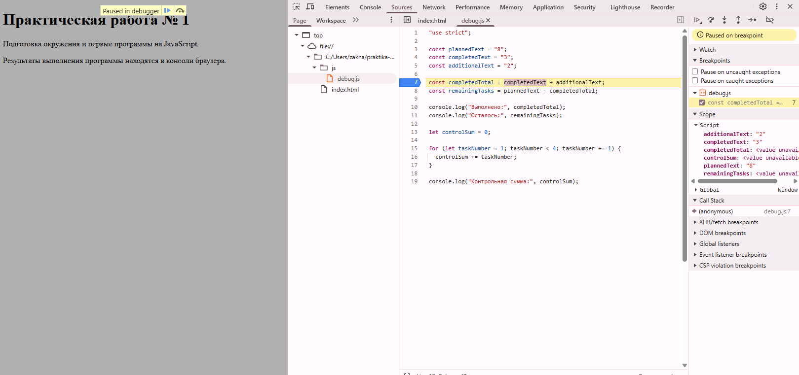

# Отчет №1

* **Студент:** Голованов Макар
* **Группа:** ЭФБО-04-25
* **Вариант:** 1

## 1. Характеристики программного окружения
* **Операционная система:** Windows
* **Версия Node.js:** v24.21.0
* **Версия npm:** 11.19.0
* **Версия Git:** 2.55.0

## 2. Результаты тестирования и выполнения заданий

### Задание 1. Сравнение сред исполнения кода
* **Вывод скрипта в терминале Node.js:** `Тип document: undefined`
* **Вывод скрипта в веб-браузере (Console):** `Тип document: object`
* **Вывод:** Глобальный объект `document` представляет собой интерфейс браузерного API для взаимодействия с веб-страницами. Среда Node.js ориентирована на серверную разработку и не содержит встроенного DOM, из-за чего попытка определить его тип возвращает значение `undefined`.

### Задание 2. Исследование динамического приведения типов

| Выражение | Итоговый результат | Полученный тип | Обоснование поведения |
|---|---|---|---|
| `"8" + 2` | `"82"` | `string` | Текстовый операнд активирует конкатенацию, сцепляя число со строкой. |
| `"8" - 2` | 6 | `number` | Вычитание принудительно переводит текстовую строку `"8"` в полноценное число. |
| `Number("8") + 2` | 10 | `number` | Выполнено явное преобразование текста в цифру 8 перед сложением. |
| `"12" > "3"` | `false` | `boolean` | Посимвольное сопоставление строк. Первые символы дают `"1" < "3"`. |
| 12 === "12" | `false` | `boolean` | Строгая проверка равенства не делает приведения типов. Разные типы не равны. |
| `Number("")` | 0 | `number` | Явное приведение пустой текстовой строки к числу по спецификации даёт 0. |
| `Number("text")` | `NaN` | `number` | Текст нельзя сконвертировать в числовое значение, возвращается маркер `NaN`. |
| `Boolean("false")` | `true` | `boolean` | Наличие любых символов в строке при логическом приведении трактуется как истина. |
| `typeof null` | `"object"` | `string` | Старая системная ошибка в логике JS. Оператор выдаёт строку `"object"`. |
| `typeof NaN` | `"number"` | `string` | Метка вычислительной ошибки `NaN` принадлежит числовому типу, а сам оператор выдаёт строку `"number"`. |

### Задание 3. Расчет прогресса по задачам
* **Исходные значения:** `totalTasks = 12`, `completedTasks = 5`
* **Вывод программы в консоль:**
  ```text
  Всего задач: 12
  Выполнено: 5
  Осталось: 7
  Прогресс: 41.7%
  Статус: В работе
  ```

### Задание 4. Построение ежедневного графика
* **Исходные значения:** `totalTasks = 12`, `completedTasks = 5`, `dailyLimit = 3`
* **Вывод программы в консоль:**
  ```text
  Осталось задач: 7
  День 1: выполнено 3, осталось 4
  День 2: выполнено 3, осталось 1
  День 3: выполнено 1, осталось 0
  Потребуется дней: 3
  ```

### Задание 5. Исправление логических ошибок при отладке
В ходе анализа исходного скрипта через DevTools были устранены два дефекта:
1. **Типы данных:** Склеивание строк при расчете общего числа выполненных задач заменено на математическое сложение путем обертывания переменных в функцию `Number()`.
2. **Параметры цикла:** В условии цикла `for` строгое неравенство `< 4` заменено на нестрогое `<= 4`, что позволило включить четвертый элемент в итоговую контрольную сумму.

#### Иллюстрация процесса отладки в браузере (Система Breakpoints)


#### Протокол вывода отлаженного кода:
```text
Выполнено: 5
Осталось: 3
Контрольная сумма: 10
```

## 3. Реализация дополнительного сценария (Вариант А)
Для разбора строковых значений разработан отдельный файл `progress-input.js`. В коде задействован метод `.trim()` для предварительной очистки пробелов.

* **Анализ контрольного вопроса:** Почему стандартного вызова `Number()` недостаточно?
* **Ответ:** Базовый метод `Number()` автоматически трансформирует пустые строки, пробельные символы, а также значение `null` в число 0. Без жесткой предварительной проверки на тип данных и структуру строки, программа обработает некорректно заполненные формы как легитимный нулевой баланс задач.